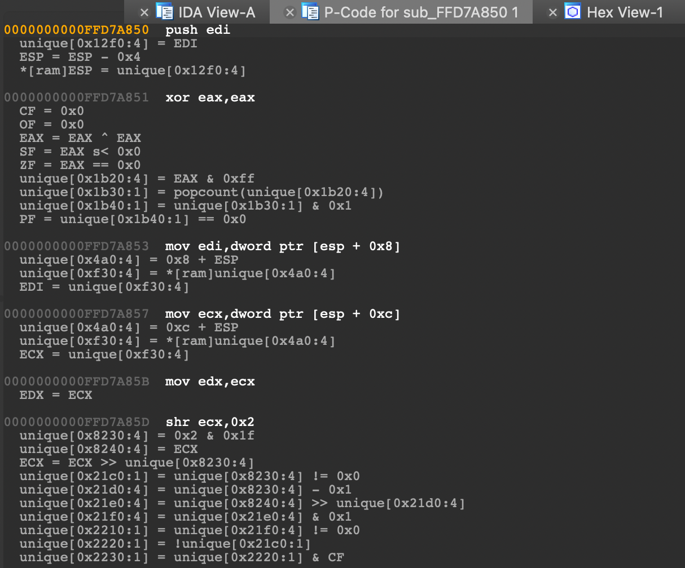

## IDA P-Code

IDA plugin displaying the P-Code for the current function.

### Usage

| Method | Action |
| --- | --- |
| From menu | `Edit -> Plugins -> IDA P-Code` |
| With hotkey | `Ctrl+Alt+S` |
| As IDAPython script | `File -> Script file... -> idapcode.py` |

### Requirements

* [pypcode](https://github.com/angr/pypcode)

### Example

